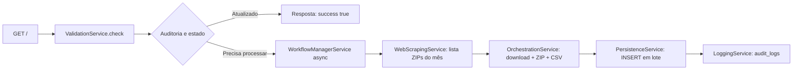

# OCI Input

Serviço **input** do ecossistema **Open Company Information (OCI)**. É uma aplicação Spring Boot que **baixa, extrai e persiste em PostgreSQL** os arquivos abertos de **Cadastro Nacional da Pessoa Jurídica (CNPJ)** publicados na web, com **controle de progresso**, **retomada após falhas** e **encerramento ordenado** da JVM.

---

## O que esta aplicação faz

1. **Descobre o mês mais recente** disponível no índice público de arquivos (via HTTP + parsing HTML com Jsoup).
2. **Lista os arquivos `.zip`** desse mês e compara com o que já foi processado (tabela de auditoria).
3. **Baixa cada ZIP**, abre as entradas e **processa CSVs** no formato da Receita Federal (separador `;`, encoding **ISO-8859-1**).
4. **Mapeia DTOs → entidades JPA** e grava em lote (batch de **5000** linhas), atualizando contadores no log de auditoria.
5. **Expõe um endpoint HTTP** que dispara ou consulta a necessidade de atualização dos dados.

A fonte configurada no código é:

`https://dados-abertos-rf-cnpj.casadosdados.com.br/arquivos/`

Os nomes dos arquivos dentro do ZIP são reconhecidos por **substring** (por exemplo `CNAE`, `MOTI`, `EMPRE`, `ESTABELE`, `SIMPLES`, `SOCIO`, etc.), conforme implementado em `OrchestrationService`.

---

## Stack tecnológica

| Área | Tecnologia |
|------|------------|
| Linguagem | Java **21** |
| Framework | Spring Boot **4.0.5** (Web, Data JPA, Flyway, Actuator) |
| Banco | **PostgreSQL** (driver + Flyway `flyway-database-postgresql`) |
| Migrações | Flyway (`src/main/resources/db/migration/`) |
| CSV | OpenCSV **5.12.0** |
| HTML / links | Jsoup (via **Spring AI** `spring-ai-jsoup-document-reader` no BOM **2.0.0-M3**) |
| HTTP cliente | `RestClient` (Spring Framework) |
| Utilitários | Lombok |
| Testes | JUnit 5, Spring Boot Test, **Testcontainers** (PostgreSQL) |
| Container local | `compose.yaml` (Postgres **15.2**), integração opcional com **spring-boot-docker-compose** |

---

## Arquitetura do fluxo ETL



- O processamento pesado roda **assíncrono** (`@EnableAsync`, pool `ETL-Processor-*` em `AsyncConfig`).
- Erros não tratados em métodos `@Async` são capturados por `AsyncUncaughtExceptionHandler`, que marca o log como **ERROR** em `LoggingService.updateLogInCaseOfError`.

---

## Modelo de dados (PostgreSQL)

O schema é criado pelo Flyway:

- **V1** — Tabelas de domínio e fatos: `cnaes`, `motivos`, `municipios`, `naturezas`, `paises`, `qualificacoes`, `empresas`, `estabelecimentos`, `simples`, `socios`, `estabelecimento_cnae` (relacionamento estabelecimento ↔ CNAEs secundários), com chaves estrangeiras e unicidades alinhadas ao modelo CNPJ aberto.
- **V2** — `audit_logs`: status do ETL, pasta/mês processado, arquivo atual, lista de arquivos já processados, registros inseridos, datas, heartbeat, tempo total, erros e contador de interrupções.

Estados do enum `ProgressStatus`: `IN_PROGRESS`, `FINISHED`, `CANCELED`, `ERROR`.

---

## Pré-requisitos

- **JDK 21**
- **Maven** (ou use o wrapper `./mvnw` na raiz do projeto)
- **PostgreSQL** acessível, com banco **`oci`** (ou o mesmo nome configurado na URL JDBC)
- Variáveis de ambiente descritas abaixo

---

## Variáveis de ambiente

| Variável | Uso |
|----------|-----|
| `DATABASE_URL` | Host (e porta, se necessário) do PostgreSQL na URL JDBC: `jdbc:postgresql://${DATABASE_URL}/oci` |
| `SUN_DATABASE_USERNAME` | Usuário do banco |
| `SUN_DATABASE_PASSWORD` | Senha do banco |

O `compose.yaml` define `POSTGRES_DB=oci`, `POSTGRES_USER` e `POSTGRES_PASSWORD` a partir de `SUN_DATABASE_USERNAME` e `SUN_DATABASE_PASSWORD`, e publica a porta **5435** → **5432** no container. Nesse caso, um valor típico para `DATABASE_URL` seria `localhost:5435`.

---

## Como executar

### 1. Subir o PostgreSQL com Docker Compose

Na raiz do repositório:

```bash
export SUN_DATABASE_USERNAME=oci
export SUN_DATABASE_PASSWORD=sua_senha
docker compose up -d
```

### 2. Configurar a URL do banco

```bash
export DATABASE_URL=localhost:5435
```

### 3. Compilar e subir a aplicação

```bash
./mvnw spring-boot:run
```

Com **spring-boot-docker-compose** no classpath (dependência `optional` do projeto), o Spring Boot pode **levantar o Compose automaticamente** em cenários de desenvolvimento; caso use apenas Docker manual, garanta que as variáveis acima estejam definidas antes de iniciar.

- **Porta HTTP padrão**: `8080` (Spring Boot).
- **Actuator** está no classpath; endpoints padrão seguem a convenção do Spring Boot (por exemplo `/actuator/health`, conforme configuração global do Boot — não há `management.*` customizado em `application.yaml`).

### Encerramento graceful

`application.yaml` define `server.shutdown: graceful` e `spring.lifecycle.timeout-per-shutdown-phase: 30s`, permitindo que requisições em andamento terminem antes do desligamento.

O componente `ShutdownDatabaseHandler` ( `SmartLifecycle`, fase mínima) marca execuções **IN_PROGRESS** como **CANCELED** com mensagem de encerramento inesperado, facilitando **retomada** posterior pela lógica de `ValidationService` / `WorkflowManagerService`.

---

## API HTTP

### `GET /`

Endpoint único exposto por `CrawlerController`. Delega a `ValidationService.check()`, que:

- Se já existir log **IN_PROGRESS**, responde que a extração já está em andamento.
- Se o **último mês/pasta** já constar como processado nos logs, responde com dados **atualizados** (`success: true`).
- Se houver cenário de **retomada** (log cancelado, conforme regras em `LoggingService`), dispara `resume()`.
- Caso contrário, inicia novo fluxo com `start()`.

Corpo de resposta (record `Response`):

- `success` (Boolean)
- `message` (String)
- `timestamp` (LocalDateTime)

---

## Comportamento de retomada e checkpoint

- **Arquivos**: `LoggingService.checkProcessedFiles` remove da fila os ZIPs já listados em `files_processed` do log corrente.
- **Dentro do CSV**: `CsvParserService` usa `records_inserted` / checkpoint do log com `withSkipLines` para pular linhas já contabilizadas ao retomar o mesmo arquivo (alinhado ao contador atualizado em `updateRecordsInserted`).

---

## Testes

```bash
./mvnw test
```

- `StartupTests`: sobe o contexto Spring (`@SpringBootTest`).
- `PersistenceServiceTest` e factories de teste usam **Testcontainers** com PostgreSQL quando aplicável.

---

## Estrutura de pacotes (visão geral)

- `controller` — REST (`CrawlerController`)
- `service` — orquestração ETL, scraping, CSV, persistência, validação, workflow, logging
- `repository` — Spring Data JPA
- `entity` / `dto` — modelo de domínio e DTOs de CSV
- `mapper` — conversão DTO ↔ entidade e resolução de FKs por mapas de códigos
- `config` — async e pool de threads
- `handler` — ciclo de vida no shutdown
- `exception` — exceções de domínio (download, ZIP, banco, etc.)

---

## Aviso sobre os dados

Os arquivos são **dados públicos** de CNPJ disponibilizados para reprodução e uso, sujeitos aos termos e à política do órgão/fonte de publicação. Esta aplicação apenas **automatiza download e carga**; a **correta interpretação legal e de privacidade** dos dados é responsabilidade de quem opera o sistema.

---

## Artefato Maven

- **groupId**: `com.gabriel-f-s.oci`
- **artifactId**: `input`
- **version**: `0.0.1-SNAPSHOT`
